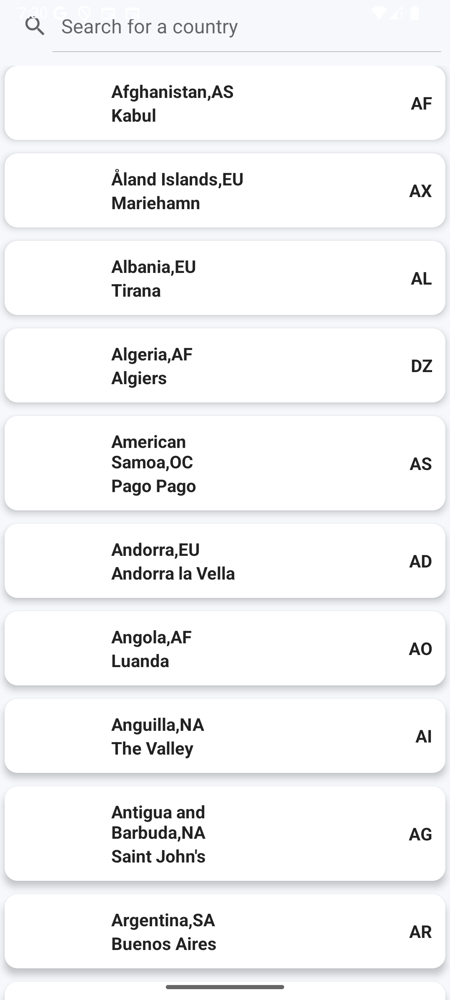
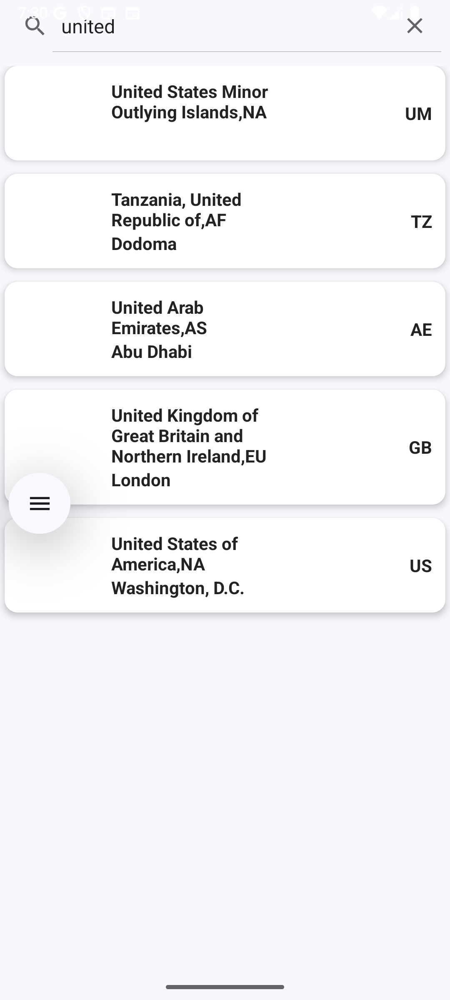
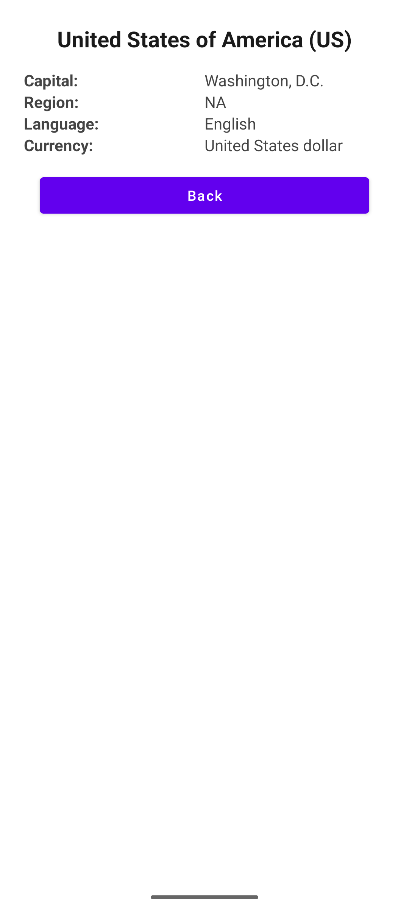
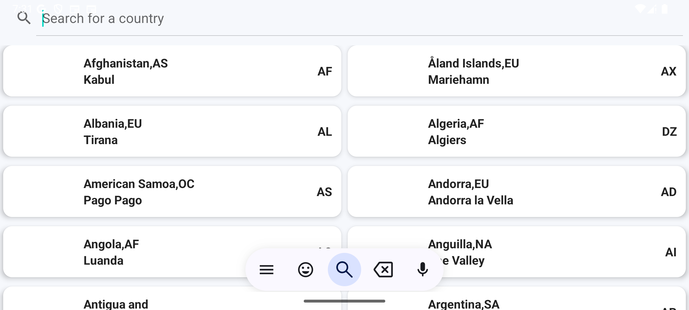

# 🌍 Country Search App

A clean and modern Android application built with Kotlin that allows users to search for countries and view their details. Designed using the **MVVM architecture**, **Retrofit** for fetching data, and **Room** for local storage.

---

## 🚀 Features

- 🔍 Search countries by name
- 🧭 Displays country code, capital, and region
- ⚡ Real-time search with debounce
- 📥 Saves data to Room for offline access
- 💡 Built with clean architecture (MVVM)

---

## 🛠 Tech Stack

- **Language**: Kotlin
- **Architecture**: MVVM (Model-View-ViewModel)
- **Networking**: Retrofit + Gson
- **Local Storage**: Room Database
- **Coroutines**: Asynchronous processing
- **Testing Ready**: Coroutine test support

---

## 📱 Screenshots

### 🏠 Home Screen

### 🔍 Search Result

### 🔍 Country Details

### 🌐 Landscape Mode

---

